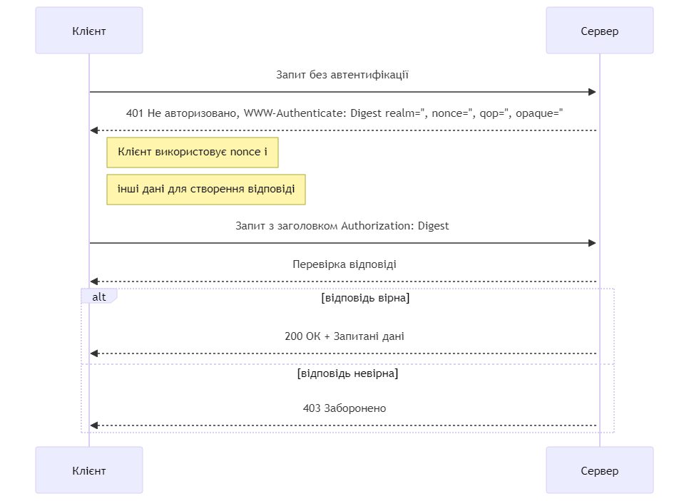

# Bachelor HTTP Digest Auth
Repository contains code of HTTP Digest Authentication for my Dyplom Bakalavra (Diploma/ qualification of Bachelor)

|             | Information                    | 
| --------    | --------                       |
| Name        | The Digest HTTP Authentication |
| Standard    | RFC 7616                       |
| Description | Digest access authentication is one of the agreed-upon methods a web server can use to negotiate credentials, such as username or password, with a user's web browser.    |

#### Diagram:
